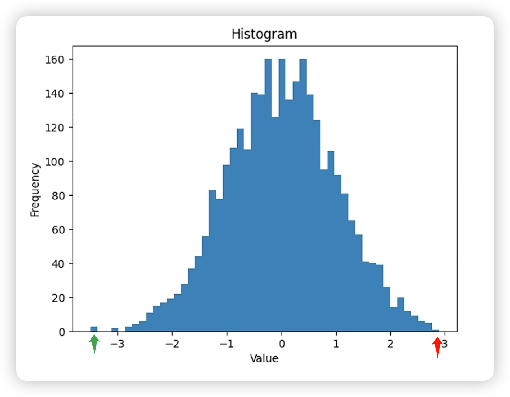
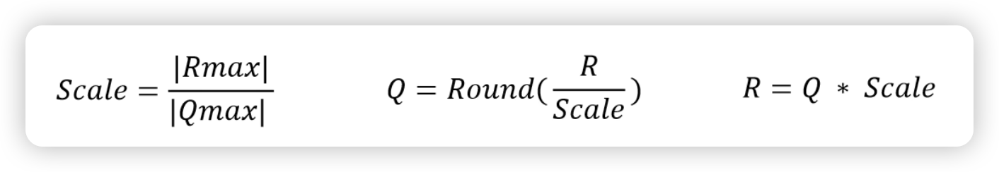

+++
title = 'Daily Log'
date = 2024-03-20T06:35:10-05:00
tags = ["Deep Learning"]
categories = ['log']
draft = false
+++

# 3.12

Managed to understand the whole code base of the [CLIP](https://openai.com/research/clip) repo from OpenAI. Planned to take a look at [CAT-Seg: Cost Aggregation for Open-Vocabulary Semantic Segmentation](https://arxiv.org/abs/2303.11797), to understand how to implement Open-Vocabulary Segmentation (OVS) using CLIP.

# 3.13

### 1. DETR

Got a basic understanding of DETR, which is an awesome end-to-end 2D object detection architecture, with its downside lies in:

- Long training period
- Difficulty of detecting small objects

but has advantages in:

- Use object queiries to replace anchor generation
- Use Hangurian algorithm to replace NMS post-processing stage

which basically replace things that are not learnable into learnable parameters.

The follow-up work: Deformable DETR, DINO, Omni-DETR, Up-DETR, PNP-DETR, SMAC-DETR, DAB-DETR, SAM-DETR, DN-, OW-, OV-, Pixel2Seq......

### 2. Picture generation survey

- GAN:
  - Merit:
    - Pictures are real.
  - Downside:
    - Unstable training process (the only noise is the initial noise at the beginning of the training).
    - The outputs lack diversity, meaning that they are close to the original pictures.
- AE (auto-encoder):
- DAE (Denoising auto-encoder):

 Added noise $X_c$ This paper proves that "Images have a high degree of redundancy". This work is also similar to MAE.

### 3. DALL·E 2

- Diffusion model is actually a multi-layered VAE.

# 3.14 3D object detection

##### 1. Datasets

- KITTY: the most classic dataset used in 3d obejct detection.
  
  

  | Category   | Truncation | Occlusion | Alpha | Bbox_X1 | Bbox_Y1 | Bbox_X2 | Bbox_Y2 | Dimensions_3D_Height | Dimensions_3D_Width | Dimensions_3D_Length | Location_X | Location_Y | Location_Z | Yaw  |
  | ---------- | ---------- | --------- | ----- | ------- | ------- | ------- | ------- | -------------------- | ------------------- | -------------------- | ---------- | ---------- | ---------- | ---- |
  | Pedestrian | 0.00       | 0         | -0.20 | 712.40  | 143.00  | 810.73  | 307.92  | 1.89                 | 0.48                | 1.20                 | 1.84       | 1.47       | 8.41       | 0.01 |

 

Can use Open3D for further use.

- Waymo: a large dataset released by Waymo in 2018.
- nuScenes: a large-scale autonomous driving dataset (used token for query).
  
  
- Argoverse2
- Lyft

##### 2. Model Zoo

# From the time zone


Most survey roughly divide the models into 4 parts: Multi-viewed, Voxel-based, Point-based, and Point-Voxel-based methods. But the overall, the improvement process from the perspective of the time zone is more likely to be digested by beginners.


(An illustration of point-based 3D object detection methods.)

### Before 2017

- **VeloFCN**: which transforms 3d point clouds to 2d front view. This is not a that good idea, as many points can be mapped to the same position as well as the lack of depth information.
- **MV3D**: Combine LiDAR Bird view (BV), LiDAR Front view (FV), and RGB Image information and fuse them together to get the overall feature. This method as for me is quite astonishing, since I think it is the pioneer model that introduce multi-modality into 3d object detection. The backend detector is typically R-CNN at that time, so it costs a lot of time.


### During 2017

Two break-through workds came out: **VoxelNet** and **PointNet++**. VoxelNet extracted the feature from the perspective of 3d voxel while PointNet++ from the aspect of point.

- **VoxelNet**: First, the point cloud is quantized into a uniform 3D grid (as shown in "grouping" in the figure below). Within each grid, a fixed number of points are randomly sampled (with repetitions if there are not enough points). Each point is represented by a 7-dimensional feature, including the X, Y, Z coordinates of the point, its reflectance intensity (R), and the position difference (ΔX, ΔY, ΔZ) relative to the grid's centroid (the mean position of all points within the grid). Fully connected layers are used to extract features from each point, and then the features of each point are concatenated with the mean features of all points within the grid to form new point features. The advantage of this feature is that it preserves both the characteristics of individual points and the characteristics of a small local area (the grid) surrounding the point. This process of point feature extraction can be repeated multiple times to enhance the descriptive power of the features (as shown in "Stacked Voxel Feature Encoding" in the figure below). Finally, a max pooling operation is performed on all points within the grid to obtain a fixed-length feature vector. All of the above is the feature extracting network. Accompany with RPN, the network can accomplish 3d object detection.


- **PointNet++**: The primary approach involves using clustering to generate multiple candidate regions (each region being a set of points), and within each candidate region, PointNet is used to extract features of the points. This process is repeated multiple times in a hierarchical manner, where the multiple sets of points output by the clustering algorithm at each iteration are treated as abstracted point clouds for subsequent processing (Set Abstraction, SA). The point features obtained in this manner have a large receptive field and contain rich contextual information from the local neighborhood. Finally, PointNet classification is performed on the sets of points produced by multiple layers of SA to distinguish between objects and the background. Similarly, this method can also be applied to point cloud segmentation.


The adantage and also the downside as compared PointNet++ with VoxelNet:

- Merit:
  - There's not that big information loss or gap in PointNet++, and there are barely any hyper-parameter for you to set up.
  - Didn't use 3D conv.
- Downside:
  - Didn't use mature 2D conv to extract feature to ensure both accuracy and efficiency.
  - Too many MLP leads to low efficiency.

### Between 2018 to 2020

During this period, lots of follow-up works came out after the invention of **VoxelNet** and **PointNet++**.

- Towards voxel-based:

  - **SECOND**: utilized sparse conv method, accelerating the speed to 26 FPS and lower and also reduces the usage of graphics memory.

  - **PointPillar**: Instead of using 3D conv, it stack all the voxels into pillars so that it can utilize the mature hardware acceleration about 2D conv, making its speed up to 62 FPS


- Towards point-based: The SA process in **PointNet++** makes the overall process slow, so many follow-up methods came up with the idea of utilizing 2D conv to solve this problem.

  - **Point-RCNN**: First, PointNet++ is used to extract features from points. These features are then used for foreground segmentation to distinguish between points on objects and background points. At the same time, each foreground point also outputs a 3D candidate bounding box (BBox). The next step involves further feature extraction from points within the candidate BBox, determining the object category to which the BBox belongs, and refining its position and size. Those familiar with 2D object detection might recognize this as a typical two-stage detection model. Indeed, but the difference is that Point-RCNN generates candidates only on foreground points, thereby avoiding the immense computational cost associated with generating dense candidate boxes in 3D space. Nevertheless, as a two-stage detector and considering the substantial computational demand of PointNet++ itself, Point-RCNN still operates at a relatively low efficiency of about 13 FPS. Point-RCNN was later extended to **Part-A2**, which achieved improvements in both speed and accuracy.

    

  - **3D-SSD**: analyzes the components of previous point-based methods and concludes that the Feature Propagation (FP) layer and the refinement layer are bottlenecks for system speed. The role of the FP layer is to remap the abstracted point features from the Set Abstraction (SA) layer back to the original point cloud, analogous to the Point Cloud Decoder in Point-RCNN as depicted in the figure above. This step is crucial because the abstract points output by SA do not effectively cover all objects, leading to significant information loss. 3D-SSD introduces a new clustering method that considers the similarity between points in both geometric and feature spaces. Through this improved clustering method, the output of the SA layer can be directly used to generate object proposals, avoiding the computational cost associated with the FP layer. Furthermore, to circumvent the region pooling in the refinement phase, 3D-SSD directly uses representative points from the SA output. It utilizes the improved clustering algorithm mentioned earlier to find neighboring points and employs a simple MLP to predict categories and 3D bounding boxes for objects. 3D-SSD can be considered an anchor-free, single-stage detector, aligning with the development trend in the object detection domain. With these improvements, 3D-SSD achieves a processing speed of 25 FPS.

    

- Integration of voxel-based and point-based methods:

  On one side, voxels heavily rely on the granularity of quantization parameters: larger grids lead to significant information loss, while smaller grids escalate computational and memory demands. Imagine trying to piece together a puzzle with either too large or too minuscule pieces – neither scenario is ideal for capturing the full picture efficiently. On the other side, points pose their own set of challenges, particularly in extracting contextual features from their neighborhoods and dealing with irregular memory access patterns. In fact, about 80% of the runtime is often consumed by data construction rather than the actual feature extraction process. It's akin to spending most of your time organizing your tools instead of painting.

  |     | VoxelNet | SECOND | PointPillar | PointRCNN | 3D-SSD |
  | --- | -------- | ------ | ----------- | --------- | ------ |
  | AP  | 64.17%   | 75.96% | 74.31%      | 75.64%    | 79.57% |
  | FPS | 2.0      | 26.3   | 62.0        | 10.0      | 25.0   |

  The fundamental strategy for merging the strengths of voxels and points involves leveraging lower-resolution voxels to capture contextual features (as seen in **PV-CNN**) or generate object candidates (like in **Fast Point RCNN**), or even both (examples include **PV-RCNN** and **SA-SSD**). Then, these are combined with the original point cloud, preserving both the nuanced features of individual points and the spatial relationships among them. Imagine blending the broad strokes of a paintbrush with the precision of a pencil to create a detailed and context-rich artwork.

  The research in **PV-CNN**, **PV-RCNN**, **Voxel R-CNN**, **CenterPoint** **TO BE CONTINUED**...

# LiDAR-based model

## Point-based model

## 2022

- SASA: Semantics-Augmented Set Abstraction for Point-based 3D Object Detection [(AAAI 22)](https://arxiv.org/pdf/2201.01976.pdf)

## 2021

- 3D Object Detection with Pointformer [(CVPR 21)](https://openaccess.thecvf.com/content/CVPR2021/papers/Pan_3D_Object_Detection_With_Pointformer_CVPR_2021_paper.pdf)

- Relation Graph Network for 3D Object Detection in Point Clouds [(T-IP 21)](https://ieeexplore.ieee.org/stamp/stamp.jsp?arnumber=9234727)

- 3D-CenterNet: 3D object detection network for point clouds with center estimation priority [(PR 21)](https://www.sciencedirect.com/science/article/pii/S0031320321000716)

## 2020

- 3DSSD: Point-based 3D Single Stage Object Detector [(CVPR 20)](https://openaccess.thecvf.com/content_CVPR_2020/papers/Yang_3DSSD_Point-Based_3D_Single_Stage_Object_Detector_CVPR_2020_paper.pdf)

- Point-GNN: Graph Neural Network for 3D Object Detection in a Point Cloud [(CVPR 20)](https://openaccess.thecvf.com/content_CVPR_2020/papers/Shi_Point-GNN_Graph_Neural_Network_for_3D_Object_Detection_in_a_CVPR_2020_paper.pdf)

- Joint 3D Instance Segmentation and Object Detection for Autonomous Driving [(CVPR 20)](https://openaccess.thecvf.com/content_CVPR_2020/papers/Zhou_Joint_3D_Instance_Segmentation_and_Object_Detection_for_Autonomous_Driving_CVPR_2020_paper.pdf)

- Improving 3D Object Detection through Progressive Population Based Augmentation [(ECCV 20)](http://www.ecva.net/papers/eccv_2020/papers_ECCV/papers/123660273.pdf)

- False Positive Removal for 3D Vehicle Detection with Penetrated Point Classifier [(ICIP 20)](https://arxiv.org/pdf/2005.13153.pdf)

## 2019

- PointRCNN: 3D Object Proposal Generation and Detection from Point Cloud [(CVPR 19)](https://openaccess.thecvf.com/content_CVPR_2019/papers/Shi_PointRCNN_3D_Object_Proposal_Generation_and_Detection_From_Point_Cloud_CVPR_2019_paper.pdf)

- Attentional PointNet for 3D-Object Detection in Point Clouds [(CVPRW 19)](https://openaccess.thecvf.com/content_CVPRW_2019/papers/WAD/Paigwar_Attentional_PointNet_for_3D-Object_Detection_in_Point_Clouds_CVPRW_2019_paper.pdf)

- STD: Sparse-to-Dense 3D Object Detector for Point Cloud [(ICCV 19)](https://openaccess.thecvf.com/content_ICCV_2019/papers/Yang_STD_Sparse-to-Dense_3D_Object_Detector_for_Point_Cloud_ICCV_2019_paper.pdf)

- StarNet: Targeted Computation for Object Detection in Point Clouds [(arXiv 19)](https://arxiv.org/pdf/1908.11069.pdf)

- PointRGCN: Graph Convolution Networks for 3D Vehicles Detection Refinement [(arXiv 19)](https://arxiv.org/pdf/1911.12236.pdf)

## 2018

- IPOD: Intensive Point-based Object Detector for Point Cloud [(arXiv 18)](https://arxiv.org/pdf/1812.05276.pdf)

## Grid-based 3D Object Detection (Voxels & Pillars)

## 2021

- Object DGCNN: 3D Object Detection using Dynamic Graphs [(NeurIPS 21)](https://arxiv.org/pdf/2110.06923.pdf)

- Center-based 3D Object Detection and Tracking [(CVPR 21)](https://openaccess.thecvf.com/content/CVPR2021/papers/Yin_Center-Based_3D_Object_Detection_and_Tracking_CVPR_2021_paper.pdf)

- Voxel Transformer for 3D Object Detection [(ICCV 21)](https://openaccess.thecvf.com/content/ICCV2021/papers/Mao_Voxel_Transformer_for_3D_Object_Detection_ICCV_2021_paper.pdf)

- LiDAR-Aug: A General Rendering-based Augmentation Framework for 3D Object Detection [(CVPR 21)](https://openaccess.thecvf.com/content/CVPR2021/papers/Fang_LiDAR-Aug_A_General_Rendering-Based_Augmentation_Framework_for_3D_Object_Detection_CVPR_2021_paper.pdf)

- RAD: Realtime and Accurate 3D Object Detection on Embedded Systems [(CVPRW 21)](https://openaccess.thecvf.com/content/CVPR2021W/WAD/papers/Aghdam_RAD_Realtime_and_Accurate_3D_Object_Detection_on_Embedded_Systems_CVPRW_2021_paper.pdf)

- AGO-Net: Association-Guided 3D Point Cloud Object Detection Network [(T-PAMI 21)](https://ieeexplore.ieee.org/stamp/stamp.jsp?arnumber=9511841)

- CIA-SSD: Confident IoU-Aware Single-Stage Object Detector From Point Cloud [(AAAI 21)](https://arxiv.org/pdf/2012.03015.pdf)

- Voxel R-CNN: Towards High Performance Voxel-based 3D Object Detection [(AAAI 21)](https://www.aaai.org/AAAI21Papers/AAAI-3337.DengJ.pdf)

- Anchor-free 3D Single Stage Detector with Mask-Guided Attention for Point Cloud [(ACM MM 21)](https://dl.acm.org/doi/pdf/10.1145/3474085.3475208)

- Integration of Coordinate and Geometric Surface Normal for 3D Point Cloud Object Detection [(IJCNN 21)](https://ieeexplore.ieee.org/stamp/stamp.jsp?tp=&arnumber=9534281)

- PSANet: Pyramid Splitting and Aggregation Network for 3D Object Detection in Point Cloud [(Sensors 21)](https://www.mdpi.com/1424-8220/21/1/136/pdf)

## 2020

- Every View Counts: Cross-View Consistency in 3D Object Detection with Hybrid-Cylindrical-Spherical Voxelization [(NeurIPS 20)](https://drive.google.com/file/d/1oXLz0SwJVn7HM85g2LUiJh6ydvvnxMqS/view)

- HVNet: Hybrid Voxel Network for LiDAR Based 3D Object Detection [(CVPR 20)](https://openaccess.thecvf.com/content_CVPR_2020/papers/Ye_HVNet_Hybrid_Voxel_Network_for_LiDAR_Based_3D_Object_Detection_CVPR_2020_paper.pdf)

- Associate-3Ddet: Perceptual-to-Conceptual Association for 3D Point Cloud Object Detection [(CVPR 20)](https://openaccess.thecvf.com/content_CVPR_2020/papers/Du_Associate-3Ddet_Perceptual-to-Conceptual_Association_for_3D_Point_Cloud_Object_Detection_CVPR_2020_paper.pdf)

- DOPS: Learning to Detect 3D Objects and Predict their 3D Shapes [(CVPR 20)](https://openaccess.thecvf.com/content_CVPR_2020/papers/Najibi_DOPS_Learning_to_Detect_3D_Objects_and_Predict_Their_3D_CVPR_2020_paper.pdf)

- Object as Hotspots: An Anchor-Free 3D Object Detection Approach via Firing of Hotspots [(ECCV 20)](https://www.ecva.net/papers/eccv_2020/papers_ECCV/papers/123660069.pdf)

- SSN: Shape Signature Networks for Multi-class Object Detection from Point Clouds [(ECCV 20)](https://www.ecva.net/papers/eccv_2020/papers_ECCV/papers/123700579.pdf)

- Pillar-based Object Detection for Autonomous Driving [(ECCV 20)](https://www.ecva.net/papers/eccv_2020/papers_ECCV/papers/123670018.pdf)

- From Points to Parts: 3D Object Detection From Point Cloud With Part-Aware and Part-Aggregation Network [(T-PAMI 20)](https://ieeexplore.ieee.org/stamp/stamp.jsp?arnumber=9018080)

- Reconfigurable Voxels: A New Representation for LiDAR-Based Point Clouds [(CoRL 20)](https://arxiv.org/pdf/2004.02724.pdf)

- SegVoxelNet: Exploring Semantic Context and Depth-aware Features for 3D Vehicle Detection from Point Cloud [(ICRA 20)](https://ieeexplore.ieee.org/stamp/stamp.jsp?arnumber=9196556)

- TANet: Robust 3D Object Detection from Point Clouds with Triple Attention [(AAAI 20)](https://ojs.aaai.org/index.php/AAAI/article/view/6837/6691)

- SARPNET: Shape attention regional proposal network for liDAR-based 3D object detection [(NeuroComputing 20)](https://www.sciencedirect.com/science/article/pii/S0925231219313827)

- Voxel-FPN: Multi-Scale Voxel Feature Aggregation for 3D Object Detection from LIDAR Point Clouds [(Sensors 20)](https://www.mdpi.com/1424-8220/20/3/704/pdf)

- BirdNet+: End-to-End 3D Object Detection in LiDAR Bird’s Eye View [(ITSC 20)](https://arxiv.org/pdf/2003.04188.pdf)

- 1st Place Solution for Waymo Open Dataset Challenge - 3D Detection and Domain Adaptation [(arXiv 20)](https://arxiv.org/pdf/2006.15505.pdf)

- AFDet: Anchor Free One Stage 3D Object Detection [(arXiv 20)](https://arxiv.org/pdf/2006.12671.pdf)

## 2019

- PointPillars: Fast Encoders for Object Detection from Point Clouds [(CVPR 19)](https://openaccess.thecvf.com/content_CVPR_2019/papers/Lang_PointPillars_Fast_Encoders_for_Object_Detection_From_Point_Clouds_CVPR_2019_paper.pdf)

- End-to-End Multi-View Fusion for 3D Object Detection in LiDAR Point Clouds [(CoRL 19)](http://proceedings.mlr.press/v100/zhou20a/zhou20a.pdf)

- IoU Loss for 2D/3D Object Detection [(3DV 19)](https://arxiv.org/pdf/1908.03851.pdf)

- Accurate and Real-time Object Detection based on Bird’s Eye View on 3D Point Clouds [(3DV 19)](https://ieeexplore.ieee.org/stamp/stamp.jsp?arnumber=8885850)

- Focal Loss in 3D Object Detection [(RA-L 19)](https://ieeexplore.ieee.org/stamp/stamp.jsp?arnumber=8624385)

- 3D-GIoU: 3D Generalized Intersection over Union for Object Detection in Point Cloud [(Sensors 19)](https://www.mdpi.com/1424-8220/19/19/4093/pdf)

- FVNet: 3D Front-View Proposal Generation for Real-Time Object Detection from Point Clouds [(CISP 19)](https://ieeexplore.ieee.org/stamp/stamp.jsp?arnumber=8965844)

- Class-balanced Grouping and Sampling for Point Cloud 3D Object Detection [(arXiv 19)](https://arxiv.org/pdf/1908.09492.pdf)

- Patch Refinement - Localized 3D Object Detection [(arXiv 19)](https://arxiv.org/pdf/1910.04093.pdf)

## 2018

- VoxelNet: End-to-End Learning for Point Cloud Based 3D Object Detection [(CVPR 18)](https://openaccess.thecvf.com/content_cvpr_2018/papers/Zhou_VoxelNet_End-to-End_Learning_CVPR_2018_paper.pdf)

- PIXOR: Real-time 3D Object Detection from Point Clouds [(CVPR 18)](https://openaccess.thecvf.com/content_cvpr_2018/papers/Yang_PIXOR_Real-Time_3D_CVPR_2018_paper.pdf)

- SECOND: Sparsely Embedded Convolutional Detection [(Sensors 18)](https://pdfs.semanticscholar.org/5125/a16039cabc6320c908a4764f32596e018ad3.pdf)

- RT3D: Real-Time 3-D Vehicle Detection in LiDAR Point Cloud for Autonomous Driving [(RA-L 18)](https://ieeexplore.ieee.org/stamp/stamp.jsp?arnumber=8403277)

- BirdNet: a 3D Object Detection Framework from LiDAR Information [(ITSC 18)](https://ieeexplore.ieee.org/stamp/stamp.jsp?arnumber=8569311)

- YOLO3D: End-to-end real-time 3D Oriented Object Bounding Box Detection from LiDAR Point Cloud [(ECCVW 18)](https://openaccess.thecvf.com/content_ECCVW_2018/papers/11131/Ali_YOLO3D_End-to-end_real-time_3D_Oriented_Object_Bounding_Box_Detection_from_ECCVW_2018_paper.pdf)

- Complex-YOLO: An Euler-Region-Proposal for Real-time 3D Object Detection on Point Clouds [(ECCVW 28)](https://openaccess.thecvf.com/content_ECCVW_2018/papers/11129/Simony_Complex-YOLO_An_Euler-Region-Proposal_for_Real-time_3D_Object_Detection_on_Point_ECCVW_2018_paper.pdf)

## 2017 or earlier

- 3D Fully Convolutional Network for Vehicle Detection in Point Cloud [(IROS 17)](https://ieeexplore.ieee.org/stamp/stamp.jsp?arnumber=8205955)

- Vote3Deep: Fast Object Detection in 3D Point Clouds Using Efficient
  Convolutional Neural Networks [(ICRA 17)](http://www.cvlibs.net/projects/autonomous_vision_survey/literature/Engelcke2016ARXIV.pdf)

- Vehicle Detection from 3D Lidar Using Fully Convolutional Network [(RSS 16)](https://arxiv.org/pdf/1608.07916.pdf)

- Voting for Voting in Online Point Cloud Object Detection [(RSS 15)](http://roboticsproceedings.org/rss11/p35.pdf)

## 3D Object Detection with Mixed Representations (point-voxel based)

## 2022

- Behind the Curtain: Learning Occluded Shapes for 3D Object Detection [(AAAI 22)](https://arxiv.org/pdf/2112.02205.pdf)

## 2021

- LiDAR R-CNN: An Efficient and Universal 3D Object Detector [(CVPR 21)](https://openaccess.thecvf.com/content/CVPR2021/papers/Li_LiDAR_R-CNN_An_Efficient_and_Universal_3D_Object_Detector_CVPR_2021_paper.pdf)

- PVGNet: A Bottom-Up One-Stage 3D Object Detector with Integrated Multi-Level Features [(CVPR 21)](https://openaccess.thecvf.com/content/CVPR2021/papers/Miao_PVGNet_A_Bottom-Up_One-Stage_3D_Object_Detector_With_Integrated_Multi-Level_CVPR_2021_paper.pdf)

- HVPR: Hybrid Voxel-Point Representation for Single-stage 3D Object Detection [(CVPR 21)](https://openaccess.thecvf.com/content/CVPR2021/papers/Noh_HVPR_Hybrid_Voxel-Point_Representation_for_Single-Stage_3D_Object_Detection_CVPR_2021_paper.pdf)

- Pyramid R-CNN: Towards Better Performance and Adaptability for 3D Object Detection [(ICCV 21)](https://openaccess.thecvf.com/content/ICCV2021/papers/Mao_Pyramid_R-CNN_Towards_Better_Performance_and_Adaptability_for_3D_Object_ICCV_2021_paper.pdf)

- Improving 3D Object Detection with Channel-wise Transformer [(ICCV 21)](https://openaccess.thecvf.com/content/ICCV2021/papers/Sheng_Improving_3D_Object_Detection_With_Channel-Wise_Transformer_ICCV_2021_paper.pdf)

- SA-Det3D: Self-Attention Based Context-Aware 3D Object Detection [(ICCVW 21)](https://arxiv.org/pdf/2101.02672.pdf)

- From Voxel to Point: IoU-guided 3D Object Detection for Point Cloud with Voxel-to-Point Decoder [(ACM MM 21)](https://dl.acm.org/doi/pdf/10.1145/3474085.3475314)

- RV-FuseNet: Range View Based Fusion of Time-Series LiDAR Data for Joint 3D Object Detection and Motion Forecasting [(IROS 21)](https://arxiv.org/pdf/2005.10863.pdf)

- Pattern-Aware Data Augmentation for LiDAR 3D Object Detection [(ITSC 21)](https://arxiv.org/pdf/2112.00050.pdf)

- From Multi-View to Hollow-3D: Hallucinated Hollow-3D R-CNN for 3D Object Detection [(T-CSVT 21)](https://ieeexplore.ieee.org/stamp/stamp.jsp?arnumber=9500203)

- Pseudo-Image and Sparse Points: Vehicle Detection With 2D LiDAR Revisited by Deep Learning-Based Methods [(T-ITS 21)](https://ieeexplore.ieee.org/stamp/stamp.jsp?arnumber=9152088)

- Dual-Branch CNNs for Vehicle Detection and Tracking on LiDAR Data [(T-ITS 21)](https://ieeexplore.ieee.org/stamp/stamp.jsp?arnumber=9142426)

- Improved Point-Voxel Region Convolutional Neural Network: 3D Object Detectors for Autonomous Driving [(T-ITS 21)](https://ieeexplore.ieee.org/stamp/stamp.jsp?arnumber=9440849)

- DSP-Net: Dense-to-Sparse Proposal Generation Approach for 3D Object Detection on Point Cloud [(IJCNN 21)](https://ieeexplore.ieee.org/stamp/stamp.jsp?arnumber=9534412)

- P2V-RCNN: Point to Voxel Feature Learning for 3D Object Detection From Point Clouds [(IEEE Access 21)](https://ieeexplore.ieee.org/stamp/stamp.jsp?arnumber=9474438)

- PV-RCNN++: Point-Voxel Feature Set Abstraction With Local Vector Representation for 3D Object Detection [(arXiv 21)](https://arxiv.org/pdf/2102.00463.pdf)

- M3DeTR: Multi-representation, Multi-scale, Mutual-relation 3D Object Detection with Transformers [(arXiv 21)](https://arxiv.org/pdf/2104.11896.pdf)

## 2020

- PV-RCNN: Point-Voxel Feature Set Abstraction for 3D Object Detection [(CVPR 20)](https://openaccess.thecvf.com/content_CVPR_2020/papers/Shi_PV-RCNN_Point-Voxel_Feature_Set_Abstraction_for_3D_Object_Detection_CVPR_2020_paper.pdf)

- Structure Aware Single-stage 3D Object Detection from Point Cloud [(CVPR 20)](https://openaccess.thecvf.com/content_CVPR_2020/papers/He_Structure_Aware_Single-Stage_3D_Object_Detection_From_Point_Cloud_CVPR_2020_paper.pdf)

- Searching Efficient 3D Architectures with Sparse Point-Voxel Convolution [(ECCV 20)](http://www.ecva.net/papers/eccv_2020/papers_ECCV/papers/123730681.pdf)

- InfoFocus: 3D Object Detection for Autonomous Driving with Dynamic Information Modeling [(ECCV 20)](https://arxiv.org/pdf/2007.08556.pdf)

- SVGA-Net: Sparse Voxel-Graph Attention Network for 3D Object Detection from Point Clouds [(arXiv 20)](https://arxiv.org/pdf/2006.04043.pdf)

## 2019

- Point-Voxel CNN for Efficient 3D Deep Learning [(NeurIPS 19)](https://proceedings.neurips.cc/paper/2019/file/5737034557ef5b8c02c0e46513b98f90-Paper.pdf)

- Fast Point R-CNN [(ICCV 19)](https://openaccess.thecvf.com/content_ICCV_2019/papers/Chen_Fast_Point_R-CNN_ICCV_2019_paper.pdf)

## 2018

- LMNet: Real-time Multiclass Object Detection on CPU Using 3D LiDAR [(ACIRS 18)](https://ieeexplore.ieee.org/stamp/stamp.jsp?arnumber=8467245)

# LiDAR & Camera Fusion for 3D Object Detection (multi-modal)

## 2022

- AutoAlign: Pixel-Instance Feature Aggregation for Multi-Modal 3D Object Detection [(arXiv 22)](https://arxiv.org/pdf/2201.06493.pdf)

- Fast-CLOCs: Fast Camera-LiDAR Object Candidates Fusion for 3D Object Detection [(WACV 22)](https://openaccess.thecvf.com/content/WACV2022/papers/Pang_Fast-CLOCs_Fast_Camera-LiDAR_Object_Candidates_Fusion_for_3D_Object_Detection_WACV_2022_paper.pdf)

## 2021

- Multimodal Virtual Point 3D Detection [(NeurIPS 21)](https://proceedings.neurips.cc/paper/2021/file/895daa408f494ad58006c47a30f51c1f-Paper.pdf)

- PointAugmenting: Cross-Modal Augmentation for 3D Object Detection [(CVPR 21)](https://vision.sjtu.edu.cn/files/cvpr21_pointaugmenting.pdf)

- Frustum-PointPillars: A Multi-Stage Approach for 3D Object Detection using RGB Camera and LiDAR [(ICCVW 21)](https://openaccess.thecvf.com/content/ICCV2021W/AVVision/papers/Paigwar_Frustum-PointPillars_A_Multi-Stage_Approach_for_3D_Object_Detection_Using_RGB_ICCVW_2021_paper.pdf)

- Multi-Stage Fusion for Multi-Class 3D Lidar Detection [(ICCVW 21)](https://openaccess.thecvf.com/content/ICCV2021W/AVVision/papers/Wang_Multi-Stage_Fusion_for_Multi-Class_3D_Lidar_Detection_ICCVW_2021_paper.pdf)

- Cross-Modality 3D Object Detection [(WACV 21)](https://openaccess.thecvf.com/content/WACV2021/papers/Zhu_Cross-Modality_3D_Object_Detection_WACV_2021_paper.pdf)

- Sparse-PointNet: See Further in Autonomous Vehicles [(RA-L 21)](https://ieeexplore.ieee.org/stamp/stamp.jsp?arnumber=9483647)

- FusionPainting: Multimodal Fusion with Adaptive Attention for 3D Object Detection [(ITSC 21)](https://arxiv.org/pdf/2106.12449.pdf)

- MF-Net: Meta Fusion Network for 3D object detection [(IJCNN 21)](https://ieeexplore.ieee.org/stamp/stamp.jsp?arnumber=9534374)

- Multi-Scale Spatial Transformer Network for LiDAR-Camera 3D Object Detection [(IJCNN 21)](https://ieeexplore.ieee.org/stamp/stamp.jsp?arnumber=9533588)

- Boost 3-D Object Detection via Point Clouds Segmentation and Fused 3-D GIoU-L1 Loss [(T-NNLS)](https://ieeexplore.ieee.org/stamp/stamp.jsp?arnumber=9241806)

- RangeLVDet: Boosting 3D Object Detection in LIDAR with Range Image and RGB Image [(Sensors Journal 21)](https://ieeexplore.ieee.org/stamp/stamp.jsp?arnumber=9612185)

- LiDAR Cluster First and Camera Inference Later: A New Perspective Towards Autonomous Driving [(arXiv 21)](https://arxiv.org/pdf/2111.09799.pdf)

- Exploring Data Augmentation for Multi-Modality 3D Object Detection [(arXiv 21)](https://arxiv.org/pdf/2012.12741.pdf)

## 2020

- PointPainting: Sequential Fusion for 3D Object Detection [(CVPR 20)](https://openaccess.thecvf.com/content_CVPR_2020/papers/Vora_PointPainting_Sequential_Fusion_for_3D_Object_Detection_CVPR_2020_paper.pdf)

- 3D-CVF: Generating Joint Camera and LiDAR Features Using Cross-View Spatial Feature Fusion for 3D Object Detection [(ECCV 20)](https://www.ecva.net/papers/eccv_2020/papers_ECCV/papers/123720715.pdf)

- EPNet: Enhancing Point Features with Image Semantics for 3D Object Detection [(ECCV 20)](https://www.ecva.net/papers/eccv_2020/papers_ECCV/papers/123600035.pdf)

- PI-RCNN: An Efficient Multi-Sensor 3D Object Detector with Point-Based Attentive Cont-Conv Fusion Module [(AAAI 20)](https://ojs.aaai.org/index.php/AAAI/article/view/6933/6787)

- CLOCs: Camera-LiDAR Object Candidates Fusion for 3D Object Detection [IROS 20](https://ieeexplore.ieee.org/stamp/stamp.jsp?arnumber=9341791)

- LRPD: Long Range 3D Pedestrian Detection Leveraging Specific Strengths of LiDAR and RGB [(ITSC 20)](https://arxiv.org/pdf/2006.09738.pdf)

- Fusion of 3D LIDAR and Camera Data for Object Detection in Autonomous Vehicle Applications [(Sensors Journal 20)](https://ieeexplore.ieee.org/stamp/stamp.jsp?arnumber=8957313)

- SemanticVoxels: Sequential Fusion for 3D Pedestrian Detection using LiDAR Point Cloud and Semantic Segmentation [(MFI 20)](https://arxiv.org/pdf/2009.12276.pdf)

## 2019

- Multi-Task Multi-Sensor Fusion for 3D Object Detection [(CVPR 19)](https://openaccess.thecvf.com/content_CVPR_2019/papers/Liang_Multi-Task_Multi-Sensor_Fusion_for_3D_Object_Detection_CVPR_2019_paper.pdf)

- Complexer-YOLO: Real-Time 3D Object Detection and Tracking on Semantic Point Clouds [(CVPRW 19)](https://openaccess.thecvf.com/content_CVPRW_2019/papers/WAD/Simon_Complexer-YOLO_Real-Time_3D_Object_Detection_and_Tracking_on_Semantic_Point_CVPRW_2019_paper.pdf)

- Sensor Fusion for Joint 3D Object Detection and Semantic Segmentation [(CVPRW 19)](https://openaccess.thecvf.com/content_CVPRW_2019/papers/WAD/Meyer_Sensor_Fusion_for_Joint_3D_Object_Detection_and_Semantic_Segmentation_CVPRW_2019_paper.pdf)

- MVX-Net: Multimodal VoxelNet for 3D Object Detection [(ICRA 19)](https://arxiv.org/pdf/1904.01649.pdf)

- SEG-VoxelNet for 3D Vehicle Detection from RGB and LiDAR Data [(ICRA 19)](https://ieeexplore.ieee.org/stamp/stamp.jsp?arnumber=8793492)

- 3D Object Detection Using Scale Invariant and Feature Reweighting Networks [(AAAI 19)](https://ojs.aaai.org/index.php/AAAI/article/download/4963/4836)

- Frustum ConvNet: Sliding Frustums to Aggregate Local Point-Wise Features for Amodal 3D Object Detection [(IROS 19)](https://ieeexplore.ieee.org/stamp/stamp.jsp?arnumber=8968513)

- Deep End-to-end 3D Person Detection from Camera and Lidar [(ITSC 19)](http://pure.tudelft.nl/ws/portalfiles/portal/68940754/roth2019itsc_lidar_person_detection.pdf)

- RoarNet: A Robust 3D Object Detection based on RegiOn Approximation Refinement [(IV 19)](https://ieeexplore.ieee.org/stamp/stamp.jsp?arnumber=8813895)

- SCANet: Spatial-channel attention network for 3D object detection [(ICASSP 19)](https://ieeexplore.ieee.org/stamp/stamp.jsp?arnumber=8682746)

- One-Stage Multi-Sensor Data Fusion Convolutional Neural Network for 3D Object Detection [(Sensors 19)](https://www.mdpi.com/1424-8220/19/6/1434/pdf)

## 2018

- Frustum PointNets for 3D Object Detection from RGB-D Data [(CVPR 18)](https://openaccess.thecvf.com/content_cvpr_2018/papers/Qi_Frustum_PointNets_for_CVPR_2018_paper.pdf)

- PointFusion: Deep Sensor Fusion for 3D Bounding Box Estimation [(CVPR 18)](https://openaccess.thecvf.com/content_cvpr_2018/papers/Xu_PointFusion_Deep_Sensor_CVPR_2018_paper.pdf)

- Deep Continuous Fusion for Multi-Sensor 3D Object Detection [(ECCV 18)](https://openaccess.thecvf.com/content_ECCV_2018/papers/Ming_Liang_Deep_Continuous_Fusion_ECCV_2018_paper.pdf)

- Joint 3D Proposal Generation and Object Detection from View Aggregation [(IROS 18)](https://ieeexplore.ieee.org/stamp/stamp.jsp?arnumber=8594049)

- A General Pipeline for 3D Detection of Vehicles [(ICRA 18)](https://ieeexplore.ieee.org/stamp/stamp.jsp?arnumber=8461232)

- Fusing Bird’s Eye View LIDAR Point Cloud and Front View Camera Image for 3D Object Detection [(IV 18)](https://ieeexplore.ieee.org/stamp/stamp.jsp?tp=&arnumber=8500387)

- Robust Camera Lidar Sensor Fusion Via Deep Gated Information Fusion Network [(IV 18)](https://ieeexplore.ieee.org/stamp/stamp.jsp?arnumber=8500711)

## 2017 or earlier

- Multi-View 3D Object Detection Network for Autonomous Driving [(CVPR 17)](https://openaccess.thecvf.com/content_cvpr_2017/papers/Chen_Multi-View_3D_Object_CVPR_2017_paper.pdf)

Tried to dive into code base [PointPillars](https://github.com/zhulf0804/PointPillars) later on (below).

# 3.15 PointPillars & Follow-up related to CLIP

### 1. PointPillars

- Setup the environment for PointPillars. The code base doesn't need any of the 3D Object Detection framework like OpenPCDet or MMDetection3d.
- Figure out the network architecture of PointPillars by looking into the code except for the network forwarding (left for tomorrow).
- The following thing to be examined will be the generation of the GT box, loss function, training, and evaluation of the model.

### 2. Open Vocabulary Segmentation paper review

- [Language-driven Semantic Segmentation](https://arxiv.org/abs/2201.03546) (Lseg)
  - Advantange:
    - Accomplished using CLIP to do OVS.
  - Downside:
    - Still a supervised learning method.
    - Accuracy is still uncomparable as compared to 1-shot method.
    - Didn't use the text as a supervised signal, meaning that the model is still relying on manual annotated mask to accomplish segmentation.
- [GroupViT: Semantic Segmentation Emerges from Text Supervision](https://arxiv.org/abs/2202.11094) (GroupViT)
  - Advantage:
    - Added Grouping Block (cluster the group) and learnable Group tokens (clustering centers).
  - Downside:
    - Still a patch-level segmentation. The final output uses bilinear interpolation.

### 3. Comparison between different frameworks of 3D object detection

### OpenPCDet

- **GitHub:** [OpenPCDet](https://github.com/open-mmlab/OpenPCDet)

- **Community:** Active

- **Code Quality:** Lightweight and readable. Some top journal papers in recent years were developed based on this framework.

- **Deployment**:

  More convenient than other frameworks, with existing deployment implementations available. Example deployment solutions include:

  - [CUDA-PointPillars](https://github.com/NVIDIA-AI-IOT/CUDA-PointPillars)
  - [PointPillars_MultiHead_40FPS](https://github.com/hova88/PointPillars_MultiHead_40FPS)
  - [OpenPCDet modified by hova88](https://github.com/hova88/OpenPCDet)

- **Recommendation:** A recommended starting point for beginners interested in learning about object detection frameworks.

### mmdetection3d

- **GitHub:** [mmdetection3d](https://github.com/open-mmlab/mmdetection3d)
- **Community:** Active
- **Documentation:** Official documentation available, facilitating easier onboarding.
- **Scope:** Compared to OpenPCDet, mmdetection3d encompasses a broader range of scenarios, including 3D detection and segmentation for images, point clouds, and multimodal data sources.
- **Code Quality:** Well-packaged, but might be more challenging for beginners. The framework is also the basis for some top journal papers in recent years.
- **Model Deployment:** Still in experimental phase.
- **Recommendation:** Suitable for those familiar with 3D object detection, offering richer content for further learning.

### Det3D

- **GitHub:** [Det3D](https://github.com/poodarchu/Det3D)
- **Community Feedback:** Previously reviewed but not extensively used in recent developments. Similar to OpenPCDet in being lightweight, but has not been updated recently.
- **Deployment Solutions:** Some existing deployment solutions are based on this framework, such as CenterPoint's deployment: [CenterPoint Deployment](https://github.com/CarkusL/CenterPoint)
- **Recommendation:** Lower priority for learning compared to OpenPCDet and mmdetection3d.

### Paddle3D

- **GitHub:** [Paddle3D](https://github.com/PaddlePaddle/Paddle3D)
- **Community Feedback:** Newly open-sourced as of August 2022, with unclear performance outcomes at the moment.

After the review, I plan to get on OpenPCDet first for its ease of understanding.

# 3.16 PointPillars

- Learned how anchor is generated and aligned with the GT boxes.
- Loss function computation is also understood, which uses Focal Loss for `<cls>` loss, and smoothL1 for regression loss.
- The training process is figured out, which uses `torch.optim.AdamW()` as the optimizer and `torch.optim.lr_scheduler.OneCycleLR()` as the scheduler.
- The following things left to be done is the prediction for a single cloud points (involves `NMS`), the visualization step, and the metrics and evaluation methods used in 3D object detection area.
- Ran KITTI benchmark on the model to check the accuracy.
  

# 3.17 Quantization & Swin-transformer

### 1. Quantization concept (apart from Pytorch)

- Linear:

  - Affine: the importance of Z offset.

    

    - int8 ( -128 ~ 127 )
    - uint8 ( 0 ~ 255 )
    - Minmax (above)
    - Histogram (two arrows shrink towards each other until below or equal to the required coverage percentage)
      
    - Entropy: **TO BE CONTINUED**...

  - Symmetric: more concise as compared to asymmetric method.

    

- Non-linear

### 2. [Swin-transformer](https://arxiv.org/abs/2103.14030):

- Used the concept of conv to let the attention be focused first only on local part and then global perspective
  
- The architecture of the network is:
  
- Completely gone through the code base of [Swin-transformer](https://github.com/WZMIAOMIAO/deep-learning-for-image-processing/tree/master/pytorch_classification/swin_transformer).

# 3.18 Quantization about Matrix Multiplication

### 1. im2col


(3 channels)


(3 kernals, transform to below)


Therefore, conv operation is successfully transformed into matrix multiplication (one kernal):


The case for three kernel is the same:


### 2. [Quantization in matrix multiplication (conv)](https://mp.weixin.qq.com/s?__biz=Mzg3ODU2MzY5MA%3D%3D&mid=2247488318&idx=1&sn=048c1b78f3b2cb25c05abb115f20d6c6&chksm=cf108b3bf867022d1b214928102d65ed691c81955b59ca02bccdee92584ad9aa8e390e1d2978&token=1388685340&lang=zh_CN#rd)


As we can see, in order to leverage GEMM(INT8) acceleration, we must kill the variable `k` in `s`.


If we kill `k` in `s`, then on the right hand side, it's just basic INT8 matrix multiplication with the left hand side is the scale. Killing the `k` also means that the scale `s` will be shared across row respective to `X` and across column respective to `W`:


Then `per-channel` is easy to explain:


# 3.19 Quantization with code

### 1. Different methods

- **Dynamic Quantization**:
  The easiest method of quantization PyTorch supports is called **dynamic quantization**. This involves not just converting the weights to int8 - as happens in all quantization variants - but also converting the activations to int8 on the fly, just before doing the computation (hence “dynamic”).

  ```python
  import torch.quantization
  quantized_model = torch.quantization.quantize_dynamic(model, {torch.nn.Linear}, dtype=torch.qint8)
  ```

 Additional adjustment may be involved, like replace the original `add` and `concat` operation with `nn.quantized.FloatFunctional`

- **Post-Training Static Quantization**:

- 

- Static quantization performs the additional step of first feeding batches of data through the network and computing the resulting distributions of the different activations (specifically, this is done by inserting “observer” modules at different points that record these distributions). This information is used to determine how specifically the different activations should be quantized at inference time

  ```python
  # set quantization config for server (x86)
  deploymentmyModel.qconfig = torch.quantization.get_default_config('fbgemm')

  # insert observers
  torch.quantization.prepare(myModel, inplace=True)
  # Calibrate the model and collect statistics

  # convert to quantized version
  torch.quantization.convert(myModel, inplace=True)
  ```

- **Quantization Aware Training**:

- 

- Quantization-aware training(QAT) is the third method, and the one that typically results in highest accuracy of these three. With QAT, all weights and activations are “fake quantized” during both the forward and backward passes of training: that is, float values are rounded to mimic int8 values, but all computations are still done with floating point numbers. Thus, all the weight adjustments during training are made while “aware” of the fact that the model will ultimately be quantized; after quantizing, therefore, this method usually yields higher accuracy than the other two methods.

  ```python
  # specify quantization config for QAT
  qat_model.qconfig=torch.quantization.get_default_qat_qconfig('fbgemm')
  
  # prepare QAT
  torch.quantization.prepare_qat(qat_model, inplace=True)
  
  # convert to quantized version, removing dropout, to check for accuracy on each
  epochquantized_model=torch.quantization.convert(qat_model.eval(), inplace=False)
  ```

  During the re-training process, we'll forward the loss of the mimic int8 values and the true values to the optimizer, so that this quantization loss will be optimized during re-training.

  - Forward process: use one of the methods from MinMax, Histogram, and Entropy to mimic the quantization
  - Backward process: use smooth derivative method so that we can get the derivarive **TO BE CONTINUED**...

### 2. Different frameworks

#### `pytorch-quantization` from Nvidia **V.S.** `torch.ao.quantization` from native Pytorch

- `torch.ao.quantization` aims primarily on CPU while `pytorch-quantization` focuses on Nvidia platform deployment.
- Overall same procedure.
- More people using the first one.
- [No one answers this question](https://discuss.pytorch.org/t/what-is-the-recommended-way-to-use-pytorch-naive-quantization-when-deploying-to-int8-tensorrt/197455).

# Things that I plan to do next week

### 1. More understanding in quantization

- Theoretical part:
  - [A White Paper on Neural Network Quantization](https://arxiv.org/abs/2106.08295)
  - [Quantization and Training of Neural Networks for Efficient Integer-Arithmetic-Only Inference](https://arxiv.org/abs/1712.05877)
- Code Practice:
  - If `torch.ao.quantization`:
    - [Official Docs](https://pytorch.org/docs/stable/quantization.html)
    - [Official Tutorials](https://pytorch.org/tutorials/search.html?q=quantization&check_keywords=yes&area=default)
  - else:
    - `pytorch-quantization` module docs and tutorial.

### 2. Span on more code of 3D object detection model

- Complete the review of code for PointPillars' predict and visualization process (link above).
- [BevFormer](https://arxiv.org/abs/2203.17270)
- [CenterNet](https://arxiv.org/abs/1904.08189) and [CenterPoint](https://arxiv.org/abs/2006.11275)
- and more...

### 3. Empirical experiment on quantization on 3d object detection model

Highly possible that the performance will not be that good on PointPillars since:


by [LiDAR-PTQ: Post-Training Quantization for Point Cloud 3D Object Detection](https://openreview.net/forum?id=0d1gQI114C).

If bad, I'll go understand the essay to explore why.

Apply all three types of methods on these models, check the performance and sort out why.

## By next week

- Get CenterPoint run on evaluation.
- Quantize CenterPoint using the three methods to check the performance as compared to un-quantized one:
  - Latency for each inference.
  - Use CUDA memory API to calculate total memory usage by the model
  - Either calculate the activation memory usage by hand or use some other tools
- After all these, try apply SmoothQuant to the model and see the result.
